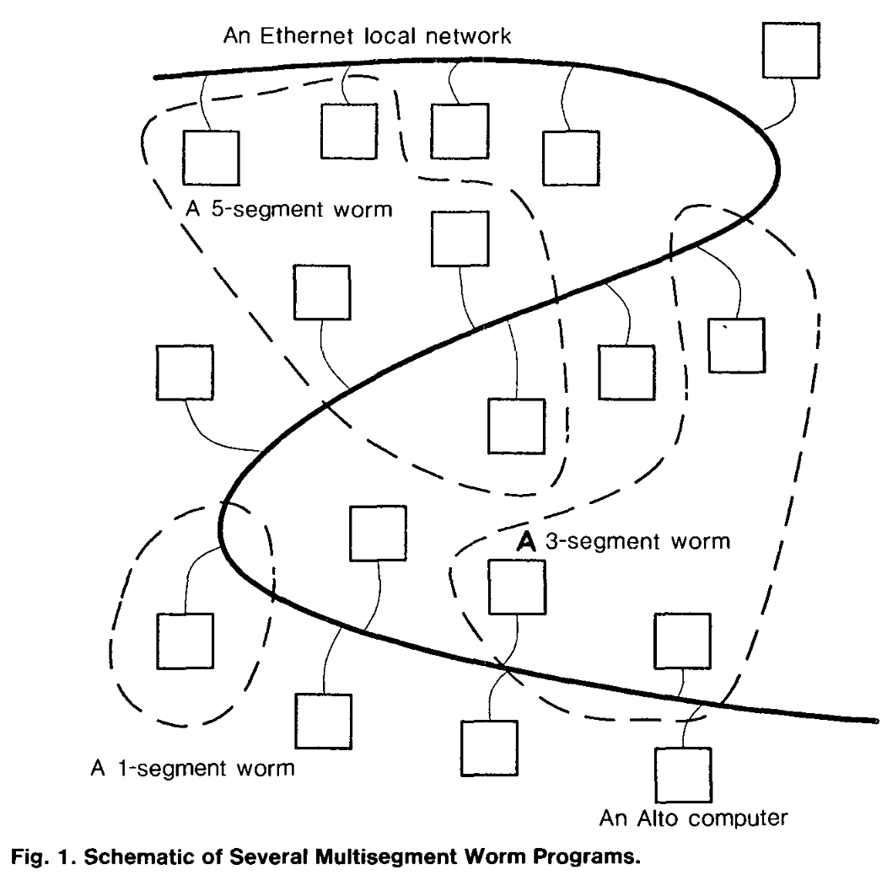

An innocent and naïve paper describing with wonder and enthusiasm Xerox Palo Alto Research Center's work with computer worms.
Computer worms are self-replicated programs that use the network to multiply across hosts.
A *segment* is an instance of the worm on particular machine.
The paper lacks a security analysis of worms which is excusable considering that computers were not widespread, and the internet became public in 1991, 9 years later.
The paper also mentions "good citizen behavior" (e.g. don't use a machine's local disk, use a protocol to ask if a machine is free, and clean up upon termination of a worm's segment).

The worm is structured similarly to a modern virus:

- The protocol used to spread the worm is similar to the infection mechanism.
- The initialization code is similar to the trigger mechanism.
- The main program is similar to the payload.

The paper identified communication with minimal delay and stability as interesting research problems regarding worms.

On the Xerox Palo Alto network, worms had 2 communication mechanisms:

1. *Pseduo-multicast ID* reserves a physical host number as a logical group address, and all participants set their host ID to this value.
2. *Brute force multicast* sends a copy of the information to each of the group's other members.

Stability referred to keeping a worm alive on the network while preventing uncontrolled growth.
Experimentally, the authors found that controlling a worm is hard.
An worm can quickly become unstable due to corruption of the worm program, new partitions in the network, and failures in communication.
They found that more communication, checks, and error detection makes worms more stable.

Worms can also be controlled using a *kill switch* where segments terminate upon receipt of a kill message.
However, corruption of the worm program might switch this off as well.
The authors also used a *worm watcher* (a primitive antivirus) that monitors the network, restricts worm size, terminates worms, and logs state changes of individual worm segments for debugging.

Several worm applications were implemented:

1. *Existential worm*: spreads across machines and tries to stay alive. Includes a self-destruct timer for individual segments to stress recovery and replication.
2. *Billboard worm*: distributes pictures across the network. Used to display a cartoon of the day.
3. *Alarm clock worm*: computer-based alarm clock which signals a specific user at a certain time and isn't tied to a specific machine. Segments accept requests and propagate new alarms across the network.
4. *Multi-machine animation*: allocates machines to a cluster using a worm. Uses a leader/follower architecture to distribute work and speed up computation.
5. *Diagnostic work for ethernet*: tests pair-wise error rates across machines in the network.

Related work notes that distributed applications have not become as popular as expected on the Arpanet. It describes a few worms and early applications of distributed computing:

1. The *Arpanet* is a distributed program.
2. *IMP programs* which migrate through the Arpanet as needed.
3. Resource sharing between Harvard and MIT using the Arpanet.
4. *McRoss* multi-machine simulation of air traffic control transfers planes between hosts.
5. *Creeper* (first computer virus) prints a message, and uses the network to move to other machines.
6. *Reaper* moved through the network trying to find and destroy copies of Creeper.
7. *Relocatable McRoss* moved entire air space simulators across machines using ideas from Creeper.
