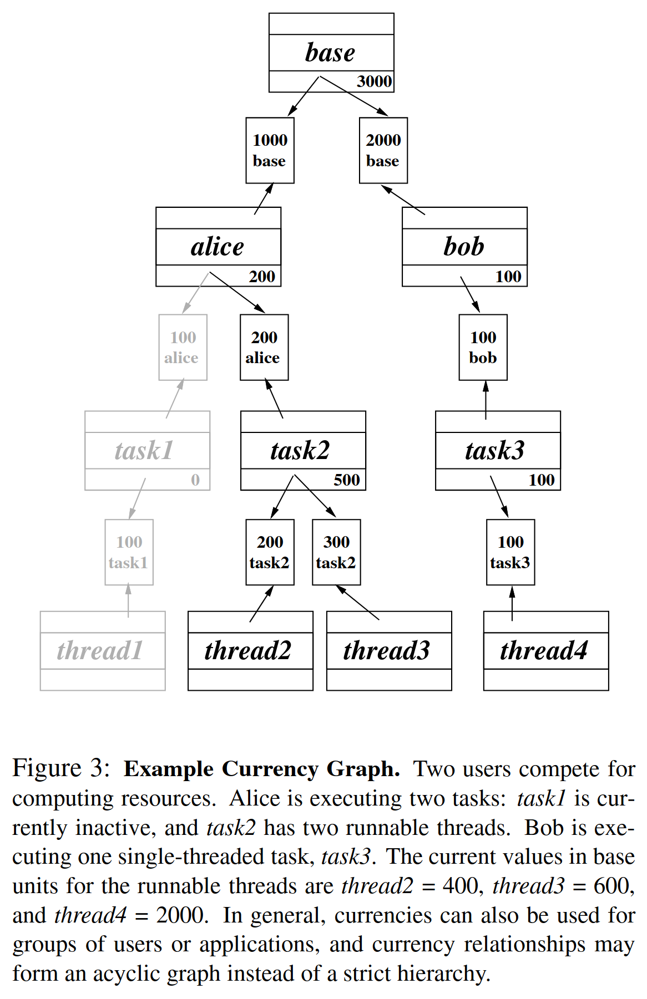

Introduces *lottery scheduling* which uses lotteries to allocate resources.
Entities competing for resources are assigned tickets based on their priority.
The higher the priority, the more tickets the task receives relative to the other competitors, ensuring that the task's chance of acquiring the resource increases.
*Inflation* occurs when entities increase their ticket counts, and may pose a problem if an adversarial task creates many tickets to monopolize a resource.
On the other hand, inflation and deflation can be used cooperatively to adjust resource allocations without explicit communication, such when scheduling Monte Carlo Simulations.

Although lottery scheduling does not use priorities, techniques like compensation tickets and ticket transfers help avoid starvation and priority inversion.
*Compensation tickets* are issued to threads that don't use their full CPU quanta (e.g. I/O bound threads).
If the thread only uses a fraction $$f$$ of its quantum, then it is granted additional compensation tickets that inflate its value by $$1/f$$ until the start of its next quantum.
This allows I/O-bound tasks that use few processor cycles to start quickly, and use the CPU proportionally to its share of lottery tickets.
*Ticket transfers* allows entities waiting on a resource to donate tickets to another task.
This is roughly equivalent to priority donation, as it solves the problem where a task with many tickets waits on a task with few tickets.

## Currencies

Lottery scheduling supports multiple currencies, with a way to convert between them.
Currencies allow modular assignments of tickets.
For example, each user might be assigned a certain number of tickets, forming a inter-user currency.
Each user might then distribute a different amounts of tickets to applications forming several intra-user currencies.
Conversions between the inter-user and intra-user currencies occur based on the user's share of the inter-user currency and an application's share of its intra-user currency. This allows each user to independently control properties of its currency (e.g. inflation, number of tickets) while allowing ticket transfers between different users' applications.

## Takeaways

The paper is well-written and explains lottery scheduling thoughtfully and intuitively.
Lottery scheduling is an elegant concept, allowing the creation of "economies" for scheduling.
Due to its probabilistic nature, lottery scheduling works particularly well with resources that are preemtible or held for a short period of time.
However long-held non-preemptible resources may be a poor fit because variability in the algorithm can cause sub-optimal resource allocations that may take long to correct.
Hard real-time scheduling is not possible because guarantees are probabilistic.
