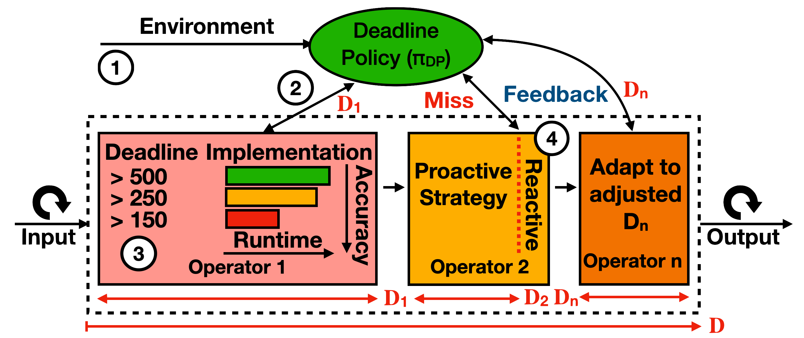

### Adjust response times and handle missed deadlines to maximize application-wide accuracy.



## Overview

## Abstract

> Autonomous vehicles (AVs) must drive across a variety of challenging
> environments that impose continuously-varying deadlines and runtime-accuracy
> tradeoffs on their software pipelines. A deadline-driven execution of such AV
> pipelines requires a new class of systems that enable the computation to
> maximize accuracy under dynamically-varying deadlines. Designing these systems
> presents interesting challenges that arise from combining ease-of-development
> of AV pipelines with deadline specification and enforcement mechanisms.
> 
> Our work addresses these challenges through D3 (**D**ynamic
> **D**eadline-**D**riven), a novel execution model that centralizes the
> deadline management, and allows applications to adjust their computation by
> modeling missed deadlines as exceptions. Further, we design and implement
> ERDOS, an open-source realization of D3 for AV pipelines that exposes
> fine-grained execution events to applications, and provides mechanisms to
> speculatively execute computation and enforce deadlines between an arbitrary
> set of events. Finally, we address the crucial lack of AV benchmarks through
> our state-of-the- art open-source AV pipeline, Pylot, that works seamlessly
> across simulators and real AVs. We evaluate the efficacy of D3 and ERDOS by
> driving Pylot across challenging driving scenarios spanning 50km, and observe
> a 68% reduction in collisions as compared to prior execution models

## Cite

```
@inproceedings{gog2022d3,
  title={D3: a dynamic deadline-driven approach for building autonomous vehicles},
  author={Gog, Ionel and Kalra, Sukrit and Schafhalter, Peter and Gonzalez, Joseph E and Stoica, Ion},
  booktitle={Proceedings of the Seventeenth European Conference on Computer Systems},
  pages={453--471},
  year={2022}
}
```
