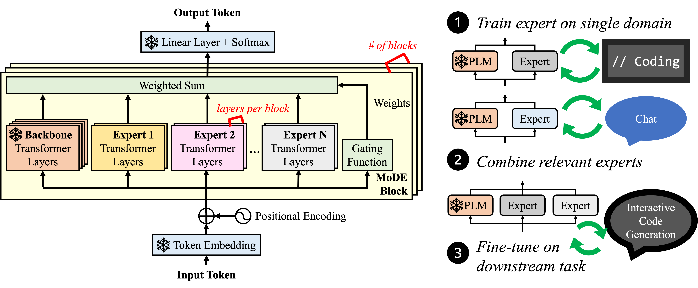

*Modular Domain Experts consist of transformer layers and are trained
independently on specific domains while preserving the backbone model's
weights. Experts are composed to increase accuracy on multi-domain tasks via a
lightweight fine-tuning step which improves downstream performance.*

## Overview

- Adapting language models to multiple domains is critical to maximizing model
  performance on complex tasks involving different capabilities.
- Key metrics include performance on the target domains, retention of general
  knowledge, and efficiency for training and inference.
- We introduce ***Mo**dular **D**omain **E**xperts* (MoDE) which augment a
  language model with modular, domain-specialized transformer layers that can
  be independently trained.
- MoDE experts can be composed improve a language model's performance on
  multiple domains while demonstrating strong retention of the original model's
  capabilities.
- ==MoDE's performance scales with the number of training examples and added
  parameters, and enables flexible sharding configurations that improve
  training speeds by up to 38%.==


## Abstract

> Domain-specific adaptation is critical to maximizing the performance of
> pre-trained language models (PLMs) on one or multiple targeted tasks,
> especially under resource-constrained use cases, such as edge devices.
> However, existing methods often struggle to balance domain-specific
> performance, retention of general knowledge, and efficiency for training and
> inference. To address these challenges, we propose ***Mo**dular **D**omain
> **E**xperts* (MoDE). MoDE is a mixture-of-experts architecture that augments a
> general PLMs with modular, domain-specialized experts. These experts are
> trained independently and composed together via a lightweight training
> process. In contrast to standard low-rank adaptation methods, each MoDE expert
> consists of several transformer layers which scale better with more training
> examples and larger parameter counts. Our evaluation demonstrates that MoDE
> achieves comparable target performances to full parameter fine-tuning while
> achieving 1.65% better retention performance. Moreover, MoDE's architecture
> enables flexible sharding configurations and improves training speeds by up to
> 38% over state-of-the-art distributed training configurations. 

## Cite

```
@article{schafhalter2024scalable,
  title={Scalable Multi-Domain Adaptation of Language Models using Modular Experts},
  author={Schafhalter, Peter and Liao, Shun and Zhou, Yanqi and Yeh, Chih-Kuan and Kandoor, Arun and Laudon, James},
  journal={arXiv preprint arXiv:2410.10181},
  year={2024}
}
```
