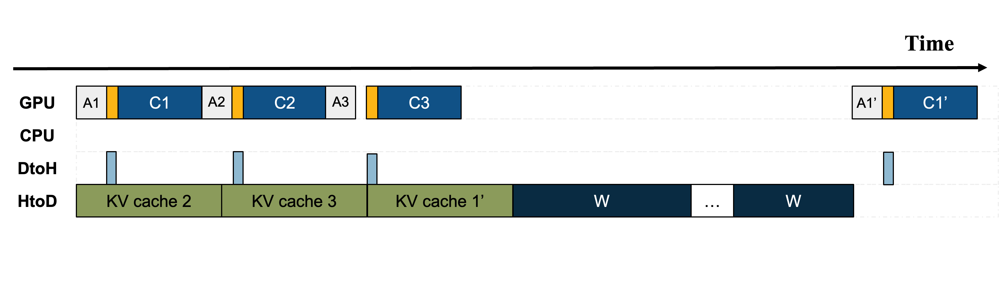

*MoE-Lightning introduces the **CGOPipe** pipelining schedule which
(1) performs attention on CPU, (2) overlaps CPU and GPU computation,
and (3) applies weights paging to increase throughput for mixture of
experts language models.*

## Overview
- While Mixture of Experts language models enhance computational efficiency by sparsely activating parameters, they require signficantly more memory compared to dense models with similar FLOPs for inference.
- For offline, batch-processing workloads with limited GPU memory, existing solutions load weights and key-value tensors layer-by-layer from CPU memory to the GPU. Such approaches fail to effectively overlap computation with data transfers, leading to under-utilization of I/O and compute.
- We analyze these bottlenecks using a *Hierarchical Roofline Model* (HRM) which models how the components of an inference system (e.g., hardware, I/O, choice of language model) affect application performance under different operational conditions.
- ==Using the HRM, we propose the CGOPipe pipeline scheduling strategy which overlaps CPU and GPU computation with I/O events to enhance token generation throughput by up to 10.3x over existing systems.==

## Abstract

Efficient deployment of large language models, particularly Mixture of Experts (MoE), on resource-constrained platforms presents significant challenges, especially in terms of computational efficiency and memory utilization. The MoE architecture, renowned for its ability to increase model capacity without a proportional increase in inference cost, greatly reduces the token generation latency compared with dense models. However, the large model size makes MoE models inaccessible to individuals without high-end GPUs. In this paper, we propose a high-throughput MoE batch inference system, that significantly outperforms past work. MoE-Lightning introduces a novel CPU-GPU-I/O pipelining schedule, CGOPipe, with paged weights to achieve high resource utilization, and a performance model, HRM, based on a Hierarchical Roofline Model we introduce to help find policies with higher throughput than existing systems. MoE-Lightning can achieve up to 10.3x higher throughput than state-of-the-art offloading-enabled LLM inference systems for Mixtral 8x7B on a single T4 GPU (16GB). When the theoretical system throughput is bounded by the GPU memory, MoE-Lightning can reach the throughput upper bound with 2-3x less CPU memory, significantly increasing resource utilization. MoE-Lightning also supports efficient batch inference for much larger MoEs (e.g., Mixtral 8x22B and DBRX) on multiple low-cost GPUs (e.g., 2-4 T4).

## Cite
```
@article{cao2024moe,
  title={MoE-Lightning: High-Throughput MoE Inference on Memory-constrained GPUs},
  author={Cao, Shiyi and Liu, Shu and Griggs, Tyler and Schafhalter, Peter and Liu, Xiaoxuan and Sheng, Ying and Gonzalez, Joseph E and Zaharia, Matei and Stoica, Ion},
  journal={arXiv preprint arXiv:2411.11217},
  year={2024}
}
```