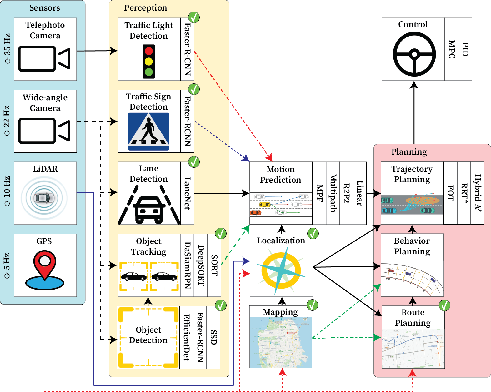

## Overview

- Autonomous vehicles are built as complex pipelines where changes to one
  component can impact the entire application.
- A more accurate object detection model with a greater runtime can worsen
  driving performance.
- ==Pylot enables end-to-end testing of new components by extending its
  state-of-the-art, modular pipeline which provides detailed debugging and
  development tools.==

## Abstract

We present Pylot, a platform for autonomous vehicle (AV) research and
development, built with the goal to allow researchers to study the effects of
the latency and accuracy of their models and algorithms on the end-to-end
driving behavior of an AV. This is achieved through a modular structure enabled
by our high-performance dataflow system that represents AV software pipeline
components (object detectors, motion planners, etc.) as a dataflow graph of
operators which communicate on data streams using timestamped messages. Pylot
readily interfaces with popular AV simulators like CARLA, and is easily
deployable to real-world vehicles with minimal code changes.

To reduce the burden of developing an entire pipeline for evaluating a single
component, Pylot provides several state-of-the- art reference implementations
for the various components of an AV pipeline. Using these reference
implementations, a Pylot-based AV pipeline is able to drive a real vehicle, and
attains a high score on the CARLA Autonomous Driving Challenge. We also present
several case studies enabled by Pylot, including evidence of a need for
context-dependent components, and per-component time allocation. Pylot is open
source, with the code available at https://github.com/erdos-project/pylot.

## Cite
```
@inproceedings{gog2021pylot,
  title={Pylot: A modular platform for exploring latency-accuracy tradeoffs in autonomous vehicles},
  author={Gog, Ionel and Kalra, Sukrit and Schafhalter, Peter and Wright, Matthew A and Gonzalez, Joseph E and Stoica, Ion},
  booktitle={2021 IEEE International Conference on Robotics and Automation (ICRA)},
  pages={8806--8813},
  year={2021},
  organization={IEEE}
}
```

---
*Equal contribution.