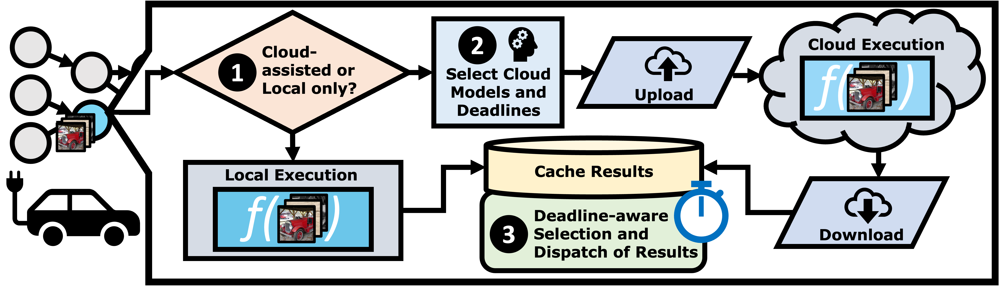

## Overview

- Autonomous vehicles (AVs) use highly accurate ML models to process sensor
  data in real time, but have limited processing power available on-board.
- While the cloud is resource-rich, accessing the cloud relies on
  unreliable cellular networks.
- With *Speculative Cloud Execution*, AVs use the cloud to generate more
  accurate results when possible and seamlessly fall back to local computation
  when network conditions degrade.
- ==We find that integrating the cloud can improve AV safety by avoiding
  collisions on complex, real-world crash scenarios from the NHTSA.==

## Abstract
> The safety of autonomous vehicles (AVs) depends on their ability to perform
> complex computations on high-volume sensor data in a timely manner. Their
> ability to run these computations with state-of-the-art models is limited by
> the processing power and slow update cycles of their onboard hardware. In
> contrast, cloud computing offers the ability to burst computation to vast
> amounts of the latest generation of hardware. However, accessing these cloud
> resources requires traversing wireless networks that are often considered to
> be too unreliable for real-time AV driving applications.
>
> Our work seeks to harness this unreliable cloud to enhance the accuracy of an
> AV's decisions, while ensuring that it can always fall back to its on-board
> computational capabilities. We identify three mechanisms that can be used by
> AVs to safely leverage the cloud for accuracy enhancements, and elaborate why
> current execution systems fail to enable these mechanisms. To address these
> limitations, we provide a system design based on the speculative execution of
> an AV's pipeline in the cloud, and show the efficacy of this approach in
> simulations of complex real-world scenarios that apply these mechanisms. 

## Cite
```
@inproceedings{schafhalter2023leveraging,
  title={Leveraging cloud computing to make autonomous vehicles safer},
  author={Schafhalter, Peter and Kalra, Sukrit and Xu, Le and Gonzalez, Joseph E and Stoica, Ion},
  booktitle={2023 IEEE/RSJ International Conference on Intelligent Robots and Systems (IROS)},
  pages={5559--5566},
  year={2023},
  organization={IEEE}
}
```
